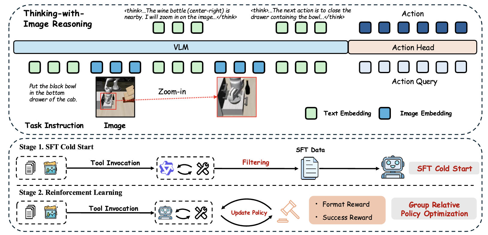

# VLA-Thinker: Boosting Vision-Language-Action Models through Thinking-with-Image Reasoning

<p align="center">
  <a href="https://arxiv.org/abs/2603.14523">
    
  </a>
  <a href="https://huggingface.co/VLA-Thinker">
    
  </a>
  <a href="https://huggingface.co/VLA-Thinker">
    
  </a>
</p>


## 👀 About VLA-Thinker

<div align="center">
  
</div>

we propose **VLA-Thinker**, a **thinking-with-image reasoning** framework for embodied intelligence that aims to break away from text-based chain-of-thought reasoning by treating visual perception as an explicit component of the reasoning process. 
Unlike traditional VLA approaches that regard visual input as a one-shot observation, VLA-Thinker actively acquires task-relevant visual information through tool invocation during reasoning, thereby enabling an interleaved and cooperative perception–reasoning–action process. 

To train such a system, we introduce a two-stage pipeline:
(1) a **SFT** cold start phase using carefully curated visual CoT data to distill foundational reasoning capabilities and operation formats; and (2) the application of **Group Relative Policy Optimization (GRPO)** to causally align the complete reasoning–action trajectories with desired task outcomes.

Experimental results demonstrate that VLA-Thinker achieves  significant  performance improvements on both the LIBERO benchmark and the RoboTwin 2.0 benchmark. Notably, VLA-Thinker attains a **97.5\%** success rate on the LIBERO benchmark, highlighting the effectiveness of our proposed framework.


## 🔄 Training Pipeline

<div align="center">
  
</div>

Training proceeds in two stages:
- **SFT cold start:** an SFT cold-start phase with curated visual Chain-of-Thought data to activate structured reasoning and tool-use behaviors.
- **GRPO-Based RL:** GRPO-based reinforcement learning to align complete reasoning-action trajectories with task-level success.


## 🏆 Performance

VLA-Thinker-7B demonstrates strong performance on LIBERO and RoboTwin 2.0 benchmarks.


<div align="center">
  
</div>

<div align="center">
  
</div>


## 📐 Set up
```
conda create -n vlathinker python=3.10 -y
conda activate vlathinker
pip install -r requirements.txt
```


## 🚀 Training
### Stage 1: Cold-start Supervised Fine-tuning (SFT)

```bash
bash examples/sft.sh
```
This expands to:
```bash
deepspeed src/train.py \
  --deepspeed ./src/configs/zero2.json \
  --base_model_path <hf_base_model_id_or_local_path> \
  --repo_id <hf_dataset_repo>/libero_cot \
  --output_dir ./checkpoints/sft/deepthinkvla/libero_cot \
  --per_device_train_batch_size 8 \
  --gradient_accumulation_steps 2 \
  --num_images_in_input 2 \
  --report_to none
```
Key flags: toggle `--num_images_in_input` for the single-camera variant, adjust `--bits`, `--lora_enable`, `--vision_lora`, and match schedules with `--max_steps`, `--save_steps`, and `--save_total_limit`.


### Stage 2: Reinforcement Learning (RL)
 Use the following command to start RL training for OpenVLA-OFT on the LIBERO or RoboTwin2.0 benchmark:

```bash
bash examples/run_openvla_oft_rl_libero.sh
or
bash examples/run_openvla_oft_rl_twin2.sh
```


## 🔮 Inference & Evaluation
To evaluate the performance of your model, enable evaluation mode by setting `trainer.val_only=True` in `examples/run_openvla_oft_rl_libero/twin2.sh`. Then, execute the same script:

```bash
bash examples/run_openvla_oft_rl_libero.sh
or
bash examples/run_openvla_oft_rl_twin2.sh
```


## Citations

If you find our work helpful for your research, please consider citing our work.   

```
@article{wang2026vla,
  title={VLA-Thinker: Boosting Vision-Language-Action Models through Thinking-with-Image Reasoning},
  author={Wang, Chaoyang and Bao, Wenrui and Gao, Sicheng and Xu, Bingxin and Tian, Yu and Rawat, Yogesh S and Ge, Yunhao and Shang, Yuzhang},
  journal={arXiv preprint arXiv:2603.14523},
  year={2026}
}
```
