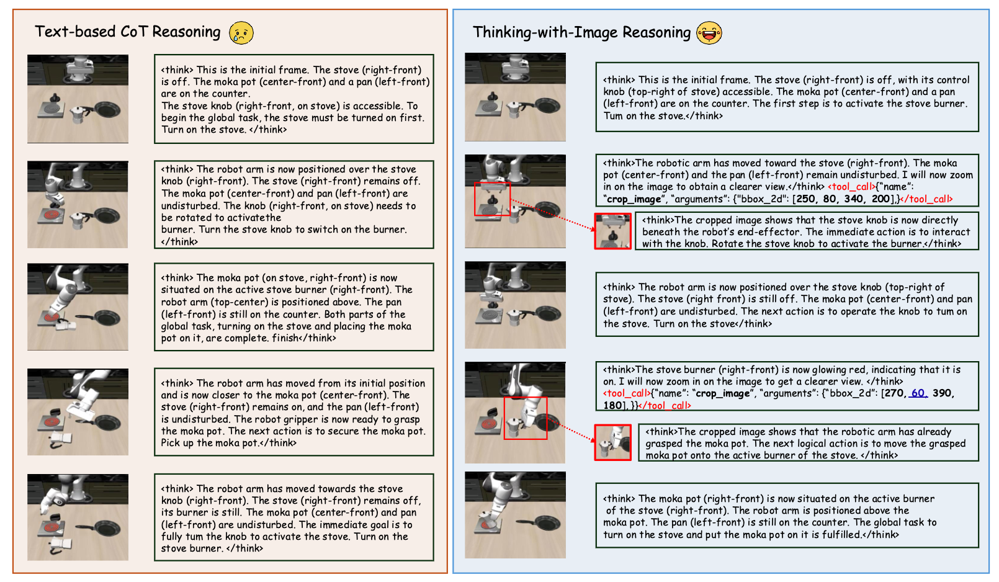
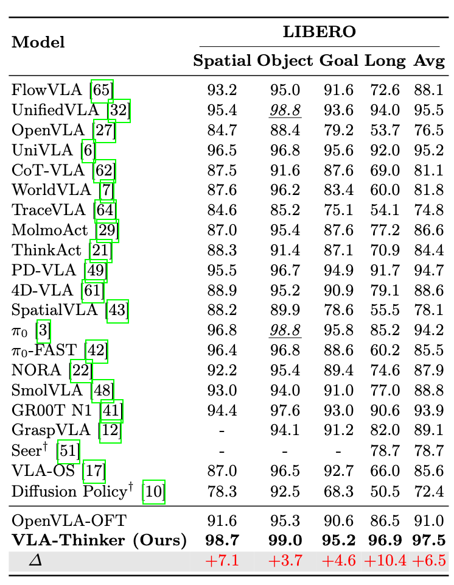
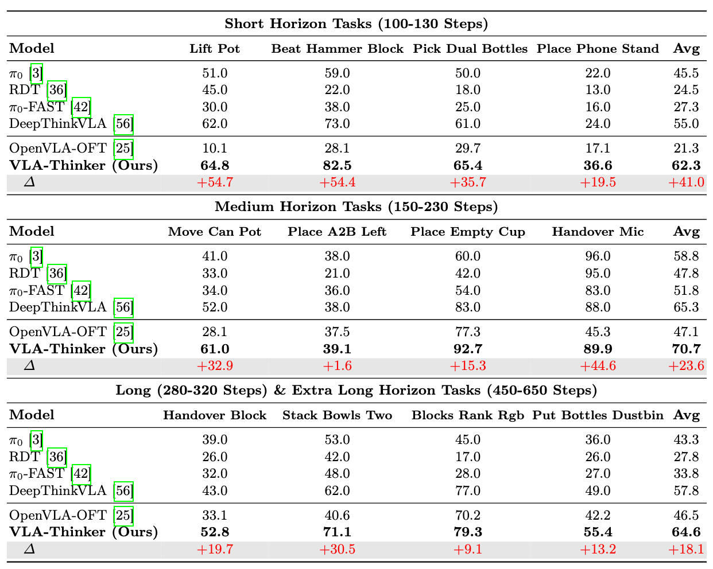

# VLA-Thinker: Boosting Vision-Language-Action Models through Thinking-with-Image Reasoning

<p align="center">
  <a href="https://arxiv.org/abs/2603.14523">
    
  </a>
  <a href="https://huggingface.co/VLA-Thinker">
    
  </a>
  <a href="https://huggingface.co/VLA-Thinker">
    
  </a>
</p>


## 👀 About VLA-Thinker

<div align="center">
  
</div>

we propose **VLA-Thinker**, a **thinking-with-image reasoning** framework for embodied intelligence that aims to break away from text-based chain-of-thought reasoning by treating visual perception as an explicit component of the reasoning process. 
Unlike traditional VLA approaches that regard visual input as a one-shot observation, VLA-Thinker actively acquires task-relevant visual information through tool invocation during reasoning, thereby enabling an interleaved and cooperative perception–reasoning–action process. 

To train such a system, we introduce a two-stage pipeline:
(1) a **SFT** cold start phase using carefully curated visual CoT data to distill foundational reasoning capabilities and operation formats; and (2) the application of **Group Relative Policy Optimization (GRPO)** to causally align the complete reasoning–action trajectories with desired task outcomes.

Experimental results demonstrate that VLA-Thinker achieves  significant  performance improvements on both the LIBERO benchmark and the RoboTwin 2.0 benchmark. Notably, VLA-Thinker attains a **97.5\%** success rate on the LIBERO benchmark, highlighting the effectiveness of our proposed framework.


## 🔥 News
- [2026/2/06] We release the code, model, data of V-Retrver


## 🏆 Performance

V-Retrver-7B demonstrates strong performance across multiple multimodal retrieval benchmarks.


<div align="center">
  
</div>


## 🎥 Reasoning Examples

 Some reasoning examples are as follows.

<div align="center">
  
</div>
<div align="center">
  
</div>
<div align="center">
  
</div>


## 📐 Set up
```
cd verltool
git submodule update --init --recursive
conda create --name v-retrver python=3.10
conda activate v-retrver
pip install -e verl
pip install -e ".[vllm,acecoder,torl,search_tool]"
pip install "flash-attn==2.8.3" --no-build-isolation
```


## 🚀 Training
### Stage 1: Cold-start Supervised Fine-tuning (SFT)

We recommend to use the popular [LLaMA-Factory](https://github.com/hiyouga/LLaMA-Factory) to perform SFT on our cold-start data.
1. Install [LLaMA-Factory](https://github.com/hiyouga/LLaMA-Factory).
2. Follow the instructions in LLaMA-Factory to configure the cold-start data in `data/dataset_info.json`, as shown below, then copy the config file `sftconfig/qwen2_5vl_retrv_full_sft.yaml` into your LLaMA-Factory codebase.
```
"V-Retrver_SFT": {
  "file_name": "[YOUR_DATASET_FOLDER]/V-Retrver_SFT.json",
  "formatting": "sharegpt",
  "columns": {
    "messages": "conversations",
    "images": "images"
  },
  "tags": {
    "role_tag": "from",
    "content_tag": "value",
    "user_tag": "human",
    "assistant_tag": "gpt",
    "system_tag": "system"
  }
}
```
4. Train Cold-start data with the training configs.
```
llamafactory-cli train sft_configs/qwen2_5vl_retrv_full_sft.yaml
```
### Stage 2: Rejection Sampling Fine-Tuning (RSFT)
In this stage, we improve reasoning reliability through Rejection Sampling.The training process and configurations for this stage are identical to Stage 1 (SFT). You simply need to prepare the RSFT dataset and follow the same training steps described in Stage 1.
### Stage 3: Reinforcement Learning (RL)
#### Training
The reinforcement learning is based on the RSFT model. You could either use the model produced in stage 1, or directly download it from [V-Retrver/V-Retrver-RFT-7B](https://huggingface.co/V-Retrver/V-Retrver-RFT-7B). 
```
cd verltool
bash examples/train/v-retrver/train_qwen25vl.sh
```
It should be able to run under 8 A800 GPUs with 80GB memory. From more details，please refer to [verl-tool](https://github.com/TIGER-AI-Lab/verl-tool).

Tips:
- if output shared memory, try lower the `data.dataloader_num_workers`
- if out of cuda memory during vllm rollout, try set `actor_rollout_ref.rollout.enforce_eager=True`, might be slower.
- if out of cuda memory during training, try lower the `use_dynamic_bs=False`.


## 🔮 Inference & Evaluation
We recommend using our provided json files and scripts for easier evaluation. 

The json files can be downloaded at: [🤗 [V-Retrver-eval-data](https://huggingface.co/datasets/V-Retrver/V-Retrver-eval-data)].

You can conduct inference on all benchmarks using the following scripts
```
cd verltool
bash examples/train/AdaTooler-V/eval.sh
```

## Acknowledgements

We sincerely appreciate the contributions of the open-source community. The related projects are as follows: [DeepThinkVLA](https://github.com/OpenBMB/DeepThinkVLA), [SimpleVLA-RL](https://github.com/PRIME-RL/SimpleVLA-RL).


## Citations

If you find our work helpful for your research, please consider citing our work.   

```
@article{wang2026vla,
  title={VLA-Thinker: Boosting Vision-Language-Action Models through Thinking-with-Image Reasoning},
  author={Wang, Chaoyang and Bao, Wenrui and Gao, Sicheng and Xu, Bingxin and Tian, Yu and Rawat, Yogesh S and Ge, Yunhao and Shang, Yuzhang},
  journal={arXiv preprint arXiv:2603.14523},
  year={2026}
}
```
